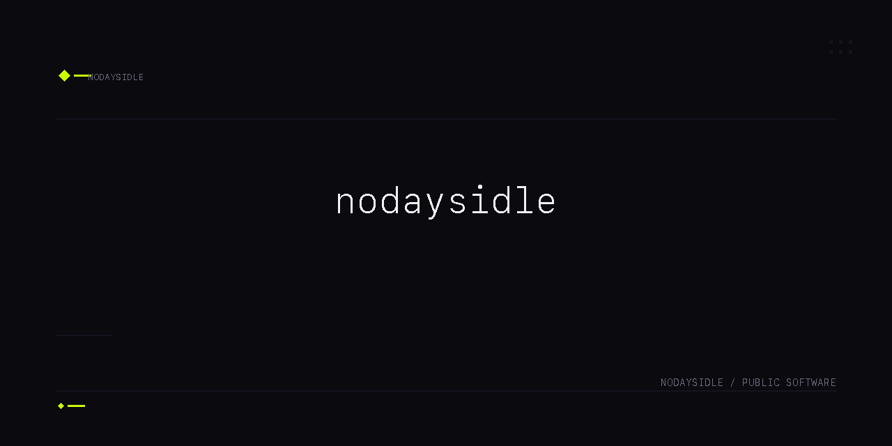
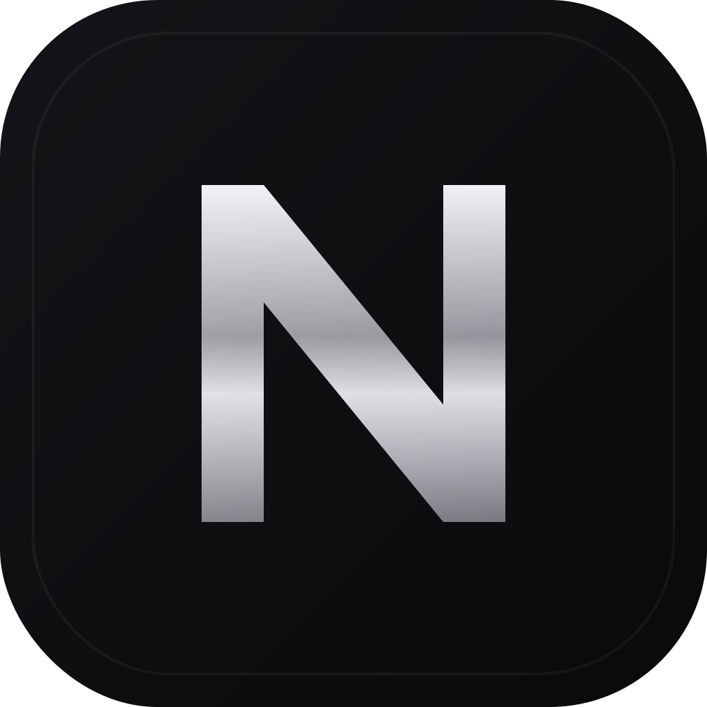

<p align="center">
  
</p>

<h1 align="center">nodaysidle</h1>

<p align="center">
  A focused, native macOS browser built with SwiftUI and WebKit.
</p>

`nodaysidle` combines a compact dark browser chrome with each website's native appearance. It keeps the interface intentionally small: tabs, navigation, search, find, zoom, and session recovery—without a custom HTML shell or shortcut-heavy start page.

## Highlights

- Native SwiftUI interface backed by `WKWebView`
- Search-first Home screen with DuckDuckGo, Google, and Brave options
- Multiple tabs, live reordering, keyboard navigation, and reopen-closed-tab
- Back, forward, reload/stop, and a Home overlay that preserves page state
- Live page title and URL updates, including single-page applications
- Find in page, page zoom, session restoration, and external-link confirmation
- HTTPS-first address resolution, with HTTP defaults limited to loopback development hosts
- Website-controlled light and dark appearance
- Native accessibility labels, focus states, and reduced-motion support
- No application telemetry

## Requirements

- macOS 14 or newer
- Swift 6 toolchain through Xcode or Xcode Command Line Tools

## Build and run

Clone the repository, then run the application directly with Swift Package Manager:

```bash
swift run nodaysidle
```

Run the test suite with:

```bash
swift test
```

## Create the macOS application

The packaging script creates a release build, generates the application icon, assembles `nodaysidle.app`, and applies an ad-hoc signature for local use:

```bash
./Scripts/package_app.sh release
open nodaysidle.app
```

Version metadata is read from `version.env`. The generated application bundle and Swift build products are intentionally excluded from Git.

## Install

To rebuild and install the application in `/Applications`:

```bash
./Scripts/install-app.sh
```

The installer replaces an existing `/Applications/nodaysidle.app`, verifies its signature, and refreshes the macOS application registration.

## Keyboard shortcuts

| Action | Shortcut |
| --- | --- |
| New tab | <kbd>⌘T</kbd> |
| Close tab | <kbd>⌘W</kbd> |
| Reopen closed tab | <kbd>⇧⌘T</kbd> |
| Focus address bar | <kbd>⌘L</kbd> |
| Reload or stop | <kbd>⌘R</kbd> |
| Find in page | <kbd>⌘F</kbd> |
| Next / previous tab | <kbd>⇧⌘]</kbd> / <kbd>⇧⌘[</kbd> |
| Select tab | <kbd>⌘1</kbd>–<kbd>⌘9</kbd> |
| Zoom in / out | <kbd>⌘+</kbd> / <kbd>⌘−</kbd> |
| Actual size | <kbd>⌘0</kbd> |

## Project structure

```text
Sources/nodaysidle/    SwiftUI application and browser implementation
Tests/nodaysidleTests/ Navigation and browser-state regression tests
Assets/                Source and generated application icons
Scripts/               Icon generation, packaging, and installation
Package.swift          Swift Package Manager configuration
version.env            Application version and build number
```

## Product scope

The current release focuses on fast, dependable browsing fundamentals. Bookmarks, a history interface, extensions, sync, and content blocking are not currently included.

Website data is managed by WebKit. Application preferences and the restorable tab session are stored locally through macOS `UserDefaults`.
